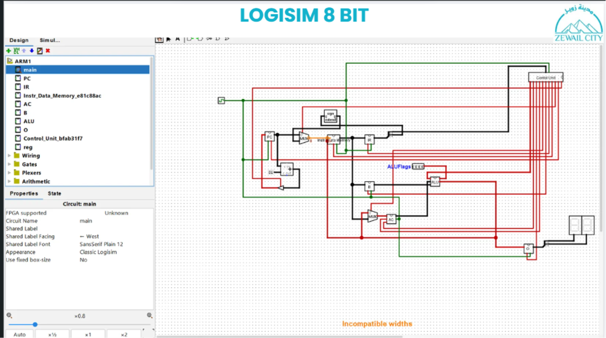
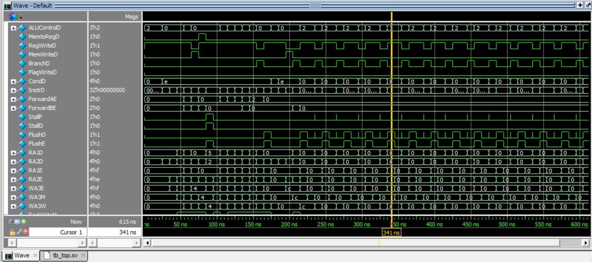
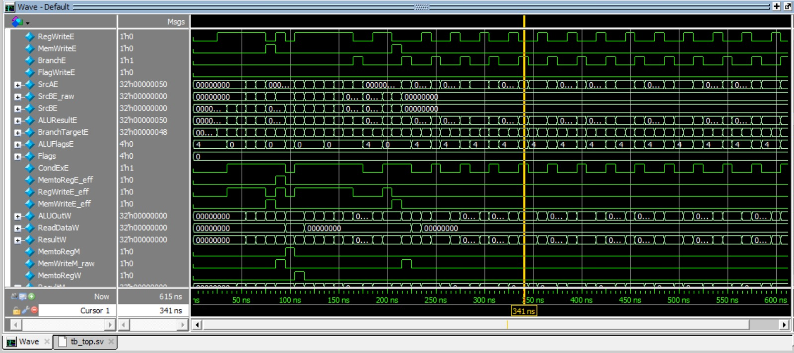
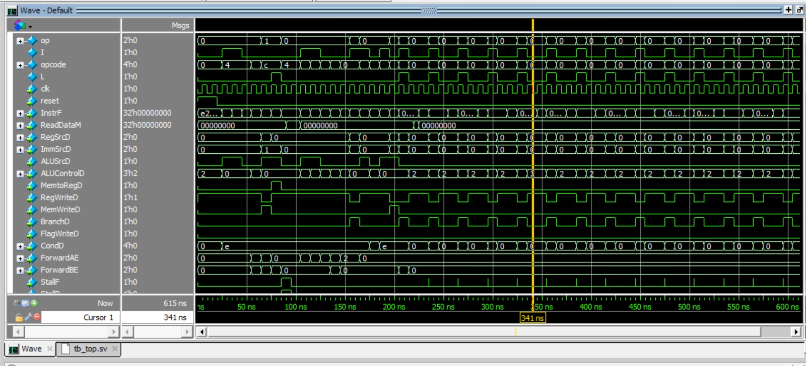
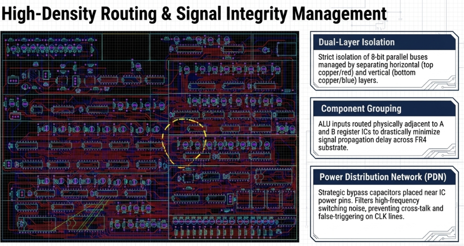
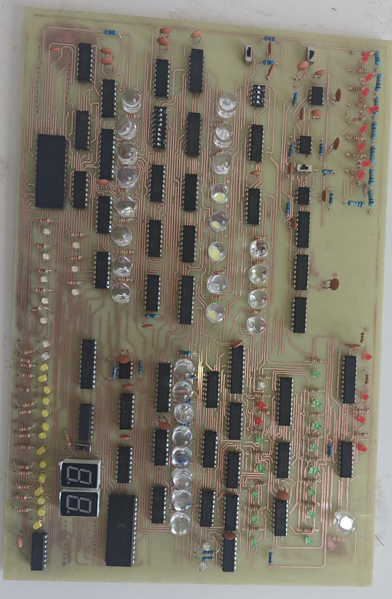
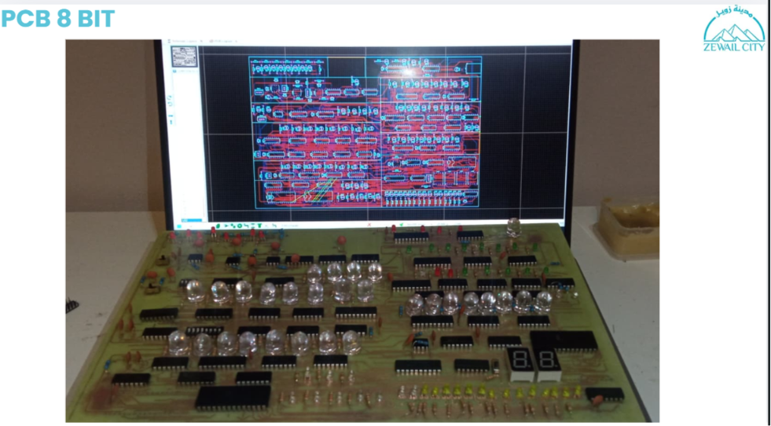

# 🖥️ ARM-1 — 8-Bit Microprocessor

<div align="center">


**A fully custom 8-bit CPU — designed from scratch, simulated in Logisim, implemented in SystemVerilog with a pipelined architecture, and realized as a physical PCB.**

</div>

---

## 📸 Project Gallery

### Logisim — Digital Circuit Simulation


### SystemVerilog — Pipelined RTL Waveforms




### PCB — Proteus Design & Physical Implementation




---

## 📁 Project Structure

```
8-Bit-Microprocessor-PCB-SystemVerilog/
│
├── 8bit computer Proteus (PCB)/   # Proteus schematic & PCB layout files
├── Logisim/                        # .circ simulation files (full datapath)
├── SystemVerilog/                  # RTL source files + testbench (tb_top.sv)
├── Presentations/                  # Project slides
├── Report/                         # Full technical documentation
└── *.png / *.jpeg                  # Project screenshots
```

---

## ⚙️ Architecture Overview

The ARM-1 is an **accumulator-based, multi-cycle processor** built on a Von Neumann memory model.

| Property | Value |
|---|---|
| Data Width | 8 bits |
| Instruction Width | 8 bits (4-bit opcode + 4-bit address) |
| Memory | 16 × 8 RAM (shared instruction/data) |
| Execution Model | Multi-cycle (Fetch → Decode → Execute) |
| Control Unit | Hardwired FSM |
| ALU Operations | Addition, Subtraction |
| Output | 8-bit binary display via 7-segment |

---

## 📋 Instruction Set (ISA)

| Opcode | Mnemonic | Operation |
|--------|----------|-----------|
| `0000` | `LDA addr` | AC ← M[addr] |
| `0001` | `ADD addr` | AC ← AC + M[addr] |
| `0010` | `SUB addr` | AC ← AC − M[addr] |
| `0101` | `STR addr` | M[addr] ← AC |
| `1110` | `OUT` | O ← AC |
| `1111` | `HLT` | Halt execution |

---

## 🔬 Implementation Layers

### 1️⃣ Logisim — Gate-Level Simulation
- Full datapath built from logic gates: PC, IR, ALU, AC, B register, Control Unit
- Ring counter FSM cycling through T1 (Fetch) → T2 (Decode) → T3 (Execute)
- Hardwired decoder asserting control signals per instruction per state

### 2️⃣ SystemVerilog — Pipelined RTL
- Pipelined microarchitecture with **hazard detection and resolution**
- **Data forwarding** (ForwardAE, ForwardBE) to eliminate RAW hazards
- **Stall logic** (StallF, StallD) for load-use hazards
- **Flush logic** (FlushD, FlushE) for control hazards / branch handling
- Verified via ModelSim/QuestaSim waveform simulation (`tb_top.sv`)

### 3️⃣ PCB — Physical Realization (Proteus)
- **Dual-layer routing** — horizontal buses on top copper (red), vertical on bottom (blue)
- **Component grouping** — ALU ICs placed adjacent to A/B register ICs to minimize propagation delay
- **Power Distribution Network (PDN)** — bypass capacitors near IC power pins to suppress switching noise
- FR4 substrate with 7-segment display output

---

## 🛠️ Tools Used

| Tool | Purpose |
|------|---------|
| Logisim | Gate-level digital circuit simulation |
| SystemVerilog + ModelSim | RTL design & pipelined simulation |
| Proteus | PCB schematic & layout design |
| Git | Version control |

---

## 🚀 How to Run

### Logisim
1. Install [Logisim Evolution](https://github.com/logisim-evolution/logisim-evolution)
2. Open `Logisim/ARM1.circ`
3. Load a program into RAM and start the clock

### SystemVerilog
```bash
# Using ModelSim / QuestaSim
vlog SystemVerilog/*.sv
vsim tb_top
# Then run the Wave window to view simulation output
```

### PCB
- Open `8bit computer Proteus (PCB)/` in Proteus 8+
- Run simulation or export Gerber files for manufacturing

---

## 👥 Team

Undergraduate project — Communications & Information Dept.
**University of Science and Technology, Zewail City**
Academic Year 2025/2026 | Supervisor: DR. Elmahdy Maree

---

## 📄 License

This project is licensed under the [MIT License](LICENSE).
